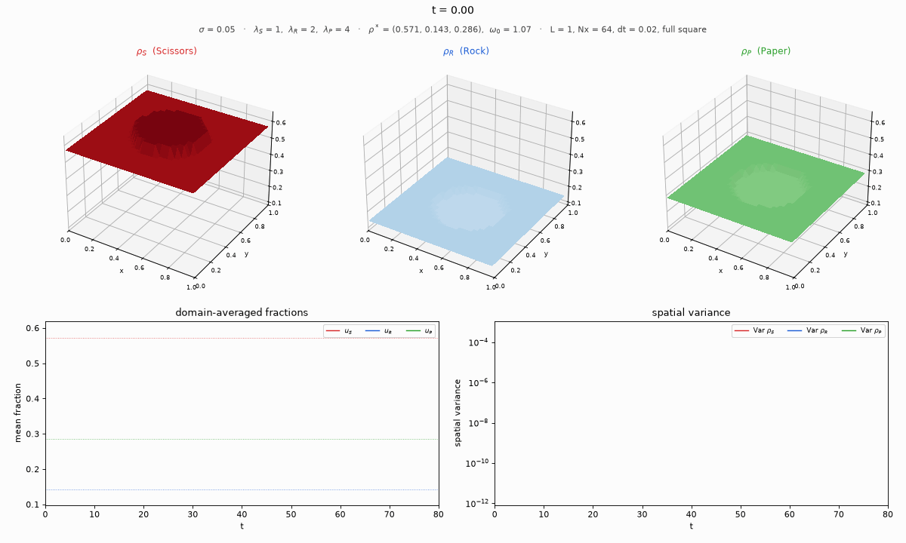
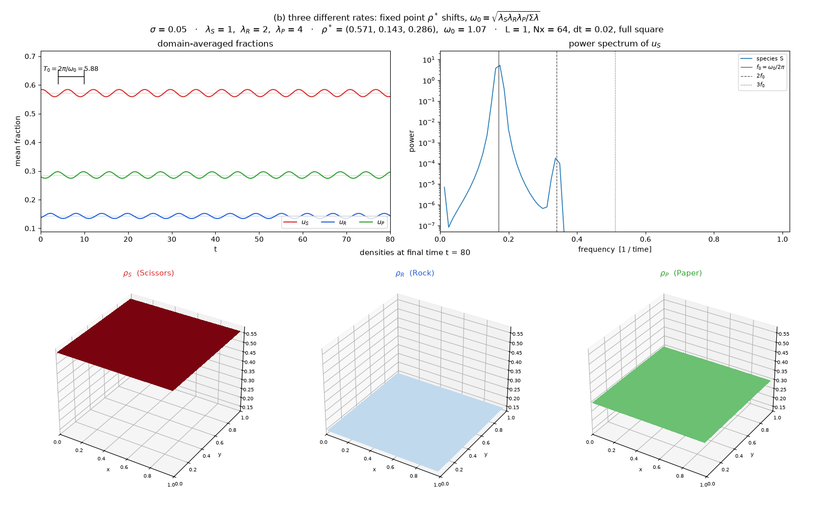
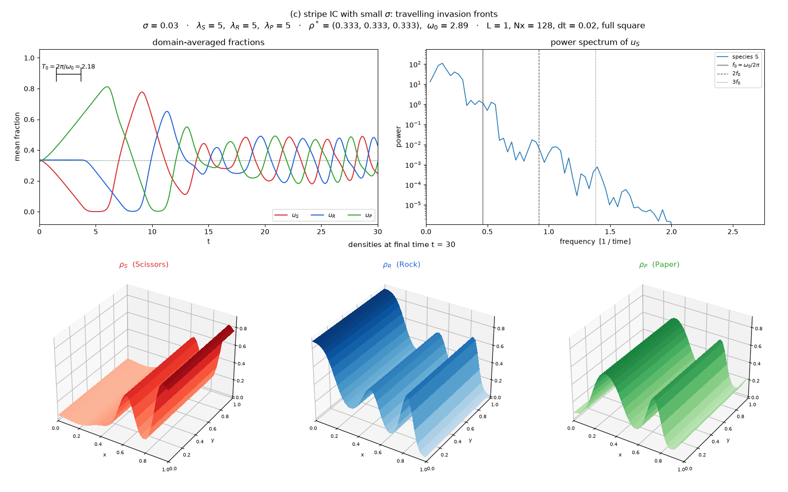
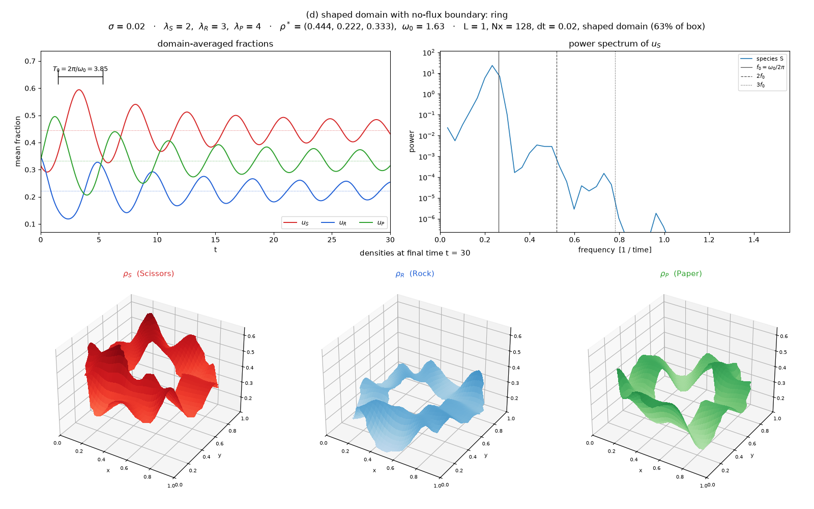
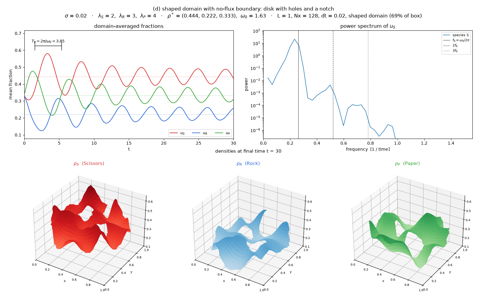

# rps-diffusion

Simulates the cyclic **Rock–Paper–Scissors reaction–diffusion PDE** with
three constant interaction rates $\lambda_S, \lambda_R, \lambda_P$:

$$
\partial_t \rho_i = \frac{\sigma^2}{2}\,\nabla^2 \rho_i + f_i(\rho),
\qquad i \in \{S, R, P\},
$$

$$
f_S = \rho_S(\lambda_S\rho_P - \lambda_R\rho_R),\qquad
f_R = \rho_R(\lambda_R\rho_S - \lambda_P\rho_P),\qquad
f_P = \rho_P(\lambda_P\rho_R - \lambda_S\rho_S).
$$

The PDE is solved on a domain $\Omega \subset [0, L]^2$ of **arbitrary shape**
(square, disk, ring, L-shape, polygon, domains with holes, any boolean
mask) with **no-flux (Neumann)** boundary conditions.

## Physical meaning

$\rho_i(\mathbf x, t)$ is the local fraction of a population playing strategy
$i$. The three rates belong to the three dominance relations:

| rate | interaction |
|---|---|
| $\lambda_S$ | Scissors beats Paper |
| $\lambda_R$ | Rock beats Scissors |
| $\lambda_P$ | Paper beats Rock |

The rates are constant in space and time. Individuals move randomly with
noise amplitude $\sigma$, which gives diffusion with $D = \sigma^2/2$. The
reaction conserves $\rho_S+\rho_R+\rho_P = 1$. The no-flux boundary means
nobody leaves the domain, so the spatial integral of each $\rho_i$ changes
only through the reaction. With equal rates $\lambda$ the model reduces to
$f_S = \lambda\rho_S(\rho_P-\rho_R)$ and so on.

## Key formulas

**Fixed point.** The interior coexistence point is

$$
\rho^* = \frac{(\lambda_P,\ \lambda_S,\ \lambda_R)}{\lambda_S+\lambda_R+\lambda_P}.
$$

Each species' share is set by the rate at which its prey is beaten by the
third species. The species with the strongest attack is therefore *not* the
most abundant ("survival of the weakest"). For equal rates,
$\rho^* = (\tfrac13, \tfrac13, \tfrac13)$.

**Linearised oscillation frequency.** Around $\rho^*$ the reaction has
purely imaginary eigenvalues $\pm i\omega_0$ with

$$
\omega_0 = \sqrt{\frac{\lambda_S\lambda_R\lambda_P}{\lambda_S+\lambda_R+\lambda_P}}
\;\xrightarrow{\ \lambda_i=\lambda\ }\; \frac{\lambda}{\sqrt 3},
\qquad T_0 = \frac{2\pi}{\omega_0}.
$$

**Diffusive damping of spatial modes.** On the square $[0,L]^2$ with
Neumann boundaries, the mode $\cos(m\pi x/L)\cos(n\pi y/L)$ decays at the rate

$$
\gamma_{mn} = \frac{\sigma^2 \pi^2 (m^2 + n^2)}{2L^2}.
$$

Because the rates are constant, the linearised reaction and the Laplacian
commute: each mode rotates at $\omega_0$ while decaying at $\gamma_{mn}$, and
the spatial mean (mode $m = n = 0$) oscillates undamped at $\omega_0$. On
other shapes the $\gamma$ are set by the Neumann eigenvalues of that domain
(for example Bessel zeros on a disk).

## Installation

```bash
cd rps_diffusion
poetry install
```

## Usage

```python
from rps_diffusion import (Domain, RPSSimulator, concentrated, fixed_point, omega0,
                           stripes, make_video, plot_fractions, dominant_frequencies)

Nx, L = 64, 1.0

# (a) equal rates + concentrated IC  ->  observe omega0 = lambda / sqrt(3)
res = RPSSimulator(2.0, sigma=0.05, L=L, dt=0.02, Nx=Nx).run(concentrated(Nx, L), t_max=60, save_every=5)
plot_fractions(res)                  # dotted lines: rho*, bracket: T0 = 2 pi / omega0
print(dominant_frequencies(res, n=1), omega0(2.0) / (2 * 3.14159))

# (b) three different rates  ->  shifted fixed point, omega0 = sqrt(lS lR lP / sum)
rates = (1.0, 2.0, 4.0)              # (lambda_S, lambda_R, lambda_P)
rs = fixed_point(rates)              # (0.571, 0.143, 0.286)
rho0 = concentrated(Nx, L, radius=0.25, u0=(rs[0] + 0.06, rs[1] - 0.03, rs[2] - 0.03), background=rs)
res = RPSSimulator(rates, sigma=0.05, dt=0.02, Nx=Nx).run(rho0, t_max=80, save_every=5)

# (c) stripe IC with small sigma  ->  travelling invasion fronts
res = RPSSimulator(5.0, sigma=0.03, dt=0.02, Nx=128).run(stripes(128), t_max=30, save_every=5)
make_video(res, "fronts.mp4")        # 3-D surfaces of rho_S, rho_R, rho_P; .gif without ffmpeg

# (d) any domain shape: no-flux boundaries hold on the boundary of the mask
dom = Domain.disk(Nx, L).cut_disk(0.5, 0.5, 0.15)          # disk with a hole
dom = Domain(Nx, L, full=False).add_polygon([(0.1, 0.1), (0.9, 0.2), (0.5, 0.9)])
res = RPSSimulator((2.0, 3.0, 4.0), sigma=0.03, dt=0.02, domain=dom).run(concentrated(Nx, L), t_max=40)
```

`make_video(res, path, style="surface")` shows the three densities as 3-D
surfaces above the mean fractions and the spatial variances.
`style="rgb"` draws one RGB image instead (red = Scissors, green = Paper,
blue = Rock). Every figure and video frame is titled with σ, the three
rates, ρ*, ω₀ and the grid.

### Domains

`Domain` is a boolean mask on the cell-centred grid, built by chaining
unions (`add_*`) and differences (`cut_*`):

| constructors | `Domain.square`, `Domain.disk`, `Domain.annulus`, `Domain.l_shape`, `Domain.polygon`, `Domain.from_mask` |
|---|---|
| union | `add_rectangle`, `add_square`, `add_disk`, `add_annulus`, `add_ellipse`, `add_polygon`, `add_function` |
| difference | `cut_rectangle`, `cut_square`, `cut_disk`, `cut_ellipse`, `cut_polygon`, `cut_function` |

A plain boolean `(Nx, Nx)` array is also accepted as `domain=`. Snapshot
cells outside the domain are `NaN`, and means and variances are taken over
the domain only.

## Running the examples

```bash
poetry install && poetry run python -m rps_diffusion.examples
```

This runs scenarios (a)–(d) in about a minute and writes one summary figure
and one video per scenario to `examples/output/`. To run a single scenario,
use for example `poetry run python -m rps_diffusion.examples.b_asymmetric_rates`.
Videos are MP4 when `ffmpeg` is on the `PATH` and GIF otherwise. MP4 files
are much smaller; on Windows, `winget install ffmpeg` provides it.

Every summary figure has the same layout. The top row shows the mean
fractions (with ρ* and the T₀ bracket) and the power spectrum (with f₀,
2f₀ and 3f₀ marked). The bottom row shows the three density surfaces at the
final time.

## Gallery

The pre-rendered outputs live in [`examples/output/`](examples/output/).

**(a) Equal rates λ = 2, concentrated IC.** The measured peak is f = 0.1838;
the prediction ω₀/2π = λ/(2π√3) is also 0.1838.


**(b) Rates (λ_S, λ_R, λ_P) = (1, 2, 4).** The measured peak is f = 0.1699
against the predicted 0.1701. The time-averaged fractions
(0.5716, 0.1430, 0.2854) match ρ* = (0.5714, 0.1429, 0.2857).




**(c) Stripe IC, λ = 5, σ = 0.03.** Travelling invasion fronts.




**(d) Shaped domains, rates (2, 3, 4).** A ring, and a disk with two holes
and a notch. No flux crosses any boundary.






## Numerics

* **Space.** A finite-volume five-point Laplacian on a cell-centred grid,
  $dx = L/N_x$. A face carries flux only if both adjacent cells lie in
  $\Omega$, which makes the no-flux condition exact on any staircase boundary
  and conserves $\int_\Omega \rho_i$ to round-off. On the full square this is
  identical to the ghost-cell scheme ($\rho_{\text{ghost}} = \rho_{\text{boundary}}$),
  and the cosine modes are exact discrete eigenvectors.
* **Time.** Heun's method (explicit RK2) is the default; forward Euler is
  available with `method="euler"`. Both have the same diffusive stability
  limit, but per step Heun inflates the neutral reaction cycles only by about
  $(\omega\,dt)^4/8$ instead of $(\omega\,dt)^2/2$. That allows a roughly 4×
  larger `dt` at better accuracy. After each step the densities are clipped
  to $[0,1]$ and renormalised so that $\rho_S+\rho_R+\rho_P=1$ in every cell.
  The stepping kernel works in place on preallocated buffers.
* **Stability.** `RPSSimulator` raises `ValueError` if
  $dt > dx^2/(4D)$, which is the 2-D form of the condition $dx^2/(2D)$. It
  warns if $\max_i\lambda_i\,dt$ exceeds 0.25 (Heun) or 0.05 (Euler).
* **Videos.** The static panels are drawn once, and each frame redraws only
  the changing artists (blitting on an off-screen Agg canvas). Frames are
  piped straight to `ffmpeg` (MP4) or encoded as a GIF with one shared
  palette. `max_frames` (default 300) caps the video length.
* **Tests.** `poetry run pytest` checks:
  * the Laplacian against the exact exponential decay of cosine modes;
  * the Bessel $J_0$ Neumann mode of the disk;
  * mass conservation on several shapes;
  * the fixed point $\rho^*$ and the Jacobian eigenvalues $\pm i\omega_0$;
  * the measured $\omega_0$ and mean $\rho^*$ of the full PDE, for equal and
    unequal rates.

## Project layout

```
rps_diffusion/
├── pyproject.toml
├── README.md
├── examples/output/     # rendered videos and summary figures
├── rps_diffusion/
│   ├── __init__.py
│   ├── _numerics.py     # masked Neumann Laplacian, CFL limit
│   ├── domain.py        # Domain (arbitrary shapes)
│   ├── initial.py       # initial-condition factories
│   ├── simulator.py     # RPSSimulator, SimResult, fixed_point, omega0
│   ├── visualize.py     # make_video, plot_fractions, plot_surfaces, ...
│   ├── analysis.py      # frequency_spectrum, dominant_frequencies
│   └── examples/        # scenarios (a)–(d), python -m rps_diffusion.examples
└── tests/
```
