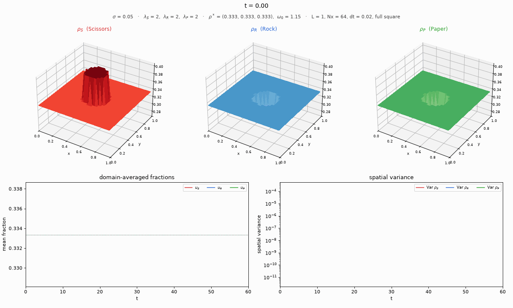
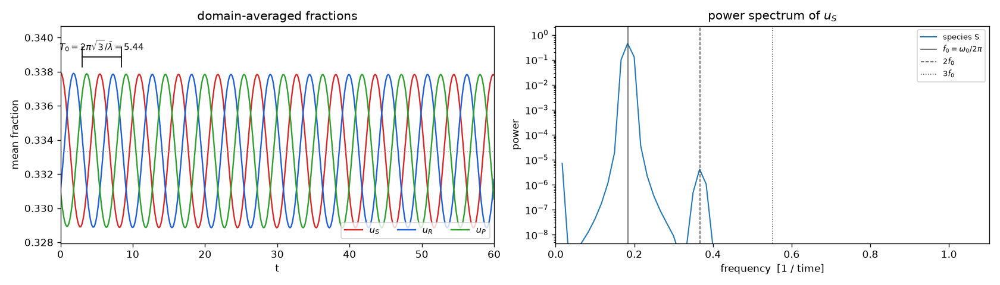
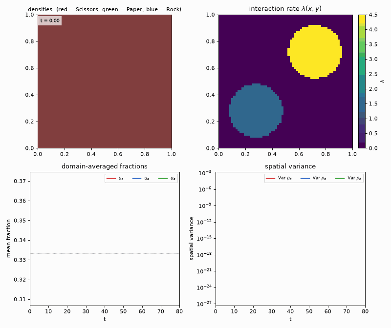
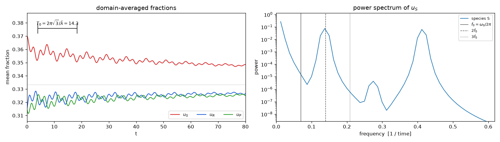
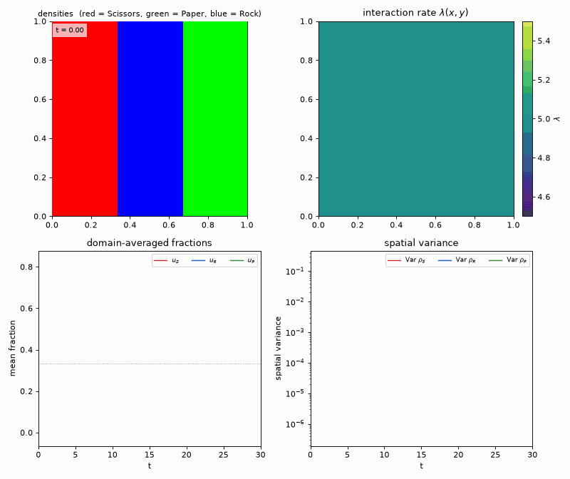
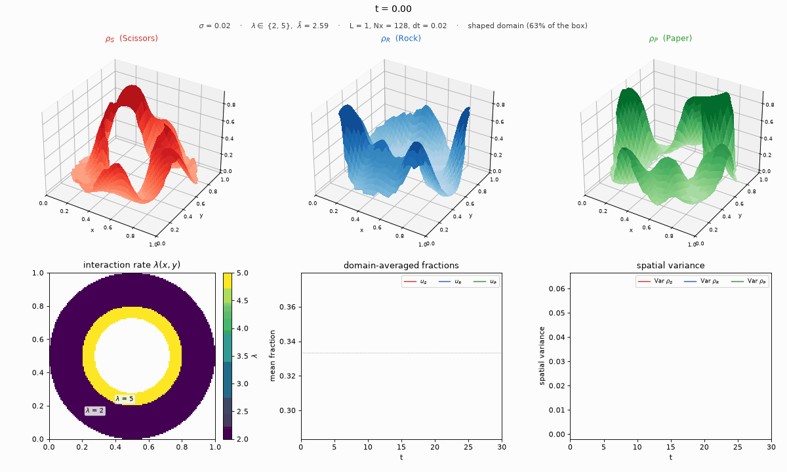
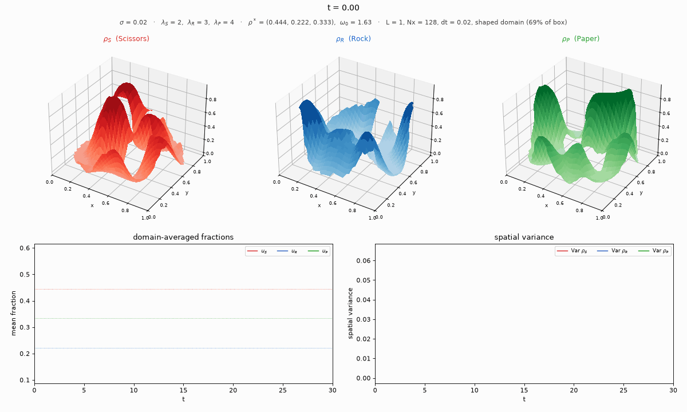

# rps-diffusion

Simulates the cyclic **Rock–Paper–Scissors reaction–diffusion PDE**

$$
\partial_t \rho_i = \frac{\sigma^2}{2}\,\nabla^2 \rho_i + \lambda(\mathbf x)\, f_i(\rho),
\qquad i \in \{S, R, P\},
$$

$$
f_S = \rho_S(\rho_P - \rho_R),\qquad
f_R = \rho_R(\rho_S - \rho_P),\qquad
f_P = \rho_P(\rho_R - \rho_S),
$$

on a domain $\Omega \subset [0, L]^2$ of **arbitrary shape** (square, disk, ring,
L-shape, polygon, domains with holes, any boolean mask) with **no-flux (Neumann)**
boundary conditions.

## Physical meaning

$\rho_i(\mathbf x, t)$ is the local fraction of a population playing strategy
$i$. Scissors beat Paper, Paper beats Rock and Rock beats Scissors. The
term $\lambda f_i$ is the replicator dynamics of this zero-sum cyclic game,
and $\lambda(\mathbf x)$ is a spatially varying interaction rate. Individuals
move randomly with noise amplitude $\sigma$, which gives diffusion with
$D = \sigma^2/2$. The no-flux boundary means nobody leaves the domain: the
spatial integral of each $\rho_i$ changes only through the reaction.

## Two key formulas

**Linearised oscillation frequency.** Around the coexistence point
$(\tfrac13, \tfrac13, \tfrac13)$ the reaction has purely imaginary eigenvalues
$\pm i\omega_0$ with

$$
\omega_0 = \frac{\lambda}{\sqrt 3}, \qquad T_0 = \frac{2\pi\sqrt3}{\lambda}.
$$

**Diffusive damping of spatial modes.** On the square $[0,L]^2$ with
Neumann boundaries, the mode $\cos(m\pi x/L)\cos(n\pi y/L)$ decays at the rate

$$
\gamma_{mn} = \frac{\sigma^2 \pi^2 (m^2 + n^2)}{2L^2}.
$$

With constant $\lambda$ the linearised reaction and the Laplacian commute,
so each mode rotates at $\omega_0$ while decaying at $\gamma_{mn}$. The spatial
mean (mode $m = n = 0$) oscillates undamped at $\omega_0$. On other shapes
the $\gamma$ are set by the Neumann eigenvalues of that domain (for example
Bessel zeros on a disk).

## Installation

```bash
cd rps_diffusion
poetry install
```

## Usage

```python
from rps_diffusion import (Domain, LambdaField, RPSSimulator, concentrated,
                           homogeneous, stripes, make_video, plot_fractions,
                           dominant_frequencies)

Nx, L = 64, 1.0

# (a) homogeneous lambda + concentrated IC  ->  observe omega0 = lambda / sqrt(3)
lam = LambdaField(Nx, L).add_background(2.0).build()
res = RPSSimulator(lam, sigma=0.05, L=L, dt=0.02).run(concentrated(Nx, L), t_max=60, save_every=5)
plot_fractions(res)                 # bracket marks T0 = 2*pi*sqrt(3)/lambda
print(dominant_frequencies(res, n=1), 2.0 / 3**0.5 / (2 * 3.14159))

# (b) two-disk lambda field  ->  two frequencies in the mean fractions
lam = (LambdaField(Nx, L).add_background(0.0)
       .add_disk(1.5, 0.28, 0.28, 0.2)
       .add_disk(4.5, 0.72, 0.72, 0.2)
       .build())
res = RPSSimulator(lam, sigma=0.02, dt=0.02).run(homogeneous(Nx, (0.37, 0.315, 0.315)), t_max=80, save_every=5)
print(dominant_frequencies(res, n=2))

# (c) stripe IC with small sigma  ->  travelling invasion fronts
lam = LambdaField(128, L).add_background(5.0).build()
res = RPSSimulator(lam, sigma=0.03, dt=0.02).run(stripes(128), t_max=30, save_every=5)
make_video(res, "fronts.mp4")       # falls back to .gif without ffmpeg

# (d) any domain shape: no-flux boundaries hold on the boundary of the mask
dom = Domain.disk(Nx, L).cut_disk(0.5, 0.5, 0.15)          # disk with a hole
dom = Domain(Nx, L, full=False).add_polygon([(0.1, 0.1), (0.9, 0.2), (0.5, 0.9)])
res = RPSSimulator(LambdaField(Nx, L).add_background(2.0).build(),
                   sigma=0.03, dt=0.02, domain=dom).run(concentrated(Nx, L), t_max=40)
```

### Domains

`Domain` is a boolean mask on the cell-centred grid, built by chaining
unions (`add_*`) and differences (`cut_*`):

| constructors | `Domain.square`, `Domain.disk`, `Domain.annulus`, `Domain.l_shape`, `Domain.polygon`, `Domain.from_mask` |
|---|---|
| union | `add_rectangle`, `add_square`, `add_disk`, `add_annulus`, `add_ellipse`, `add_polygon`, `add_function` |
| difference | `cut_rectangle`, `cut_square`, `cut_disk`, `cut_ellipse`, `cut_polygon`, `cut_function` |

A plain boolean `(Nx, Nx)` array is also accepted as `domain=`. Snapshot
cells outside the domain are `NaN`. Means, variances and $\bar\lambda$ are
taken over the domain only.

## Running the examples

```bash
poetry install && poetry run python -m rps_diffusion.examples
```

This runs scenarios (a)–(d) in about 45 s and writes videos and plots to
`examples/output/`. To run a single scenario, use for example
`poetry run python -m rps_diffusion.examples.b_two_disks`. Videos are MP4
when `ffmpeg` is on the `PATH` and GIF otherwise. MP4 files are much
smaller; on Windows, `winget install ffmpeg` provides it.

## Gallery

The pre-rendered outputs live in [`examples/output/`](examples/output/).

**(a) Homogeneous λ = 2, concentrated IC.** The measured peak is f = 0.1838,
and the prediction ω₀/2π = λ/(2π√3) is also 0.1838.




**(b) Two disks, λ₁ = 1.5 and λ₂ = 4.5.** The measured peaks are 0.1374 and
0.4133; the predictions are 0.1378 and 0.4135.




**(c) Stripe IC, σ = 0.03.** Travelling invasion fronts.



**(d) Shaped domains.** A ring, and a disk with two holes and a notch. No
flux crosses any boundary.




## Numerics

* **Space.** A finite-volume five-point Laplacian on a cell-centred grid,
  $dx = L/N_x$. A face carries flux only if both adjacent cells lie in
  $\Omega$, which makes the no-flux condition exact on any staircase boundary
  and conserves $\int_\Omega \rho_i$ to round-off. On the full square this is
  identical to the ghost-cell scheme ($\rho_{\text{ghost}} = \rho_{\text{boundary}}$),
  and the cosine modes are exact discrete eigenvectors.
* **Time.** Heun's method (explicit RK2) is the default; forward Euler is
  available with `method="euler"`. Both have the same diffusive stability
  limit, but per step Heun inflates the neutral reaction cycles only by about
  $(\omega\,dt)^4/8$ instead of $(\omega\,dt)^2/2$. That allows a roughly 4×
  larger `dt` at better accuracy. After each step the densities are clipped
  to $[0,1]$ and renormalised so that $\rho_S+\rho_R+\rho_P=1$ in every cell.
  The stepping kernel works in place on preallocated buffers.
* **Stability.** `RPSSimulator` raises `ValueError` if
  $dt > dx^2/(4D)$, which is the 2-D form of the condition $dx^2/(2D)$. It
  warns if $\lambda_{\max}\,dt$ exceeds 0.25 (Heun) or 0.05 (Euler).
* **Videos.** The static panels are drawn once, and each frame redraws only
  the changing artists (blitting on an off-screen Agg canvas). Frames are
  piped straight to `ffmpeg` (MP4) or encoded as a GIF with one shared
  palette. `max_frames` (default 300) caps the video length.
* **Tests.** `poetry run pytest` checks the Laplacian against the exact
  exponential decay of cosine modes, the Bessel $J_0$ Neumann mode of the
  disk, mass conservation on several shapes, and the measured $\omega_0$.

## Project layout

```
rps_diffusion/
├── pyproject.toml
├── README.md
├── rps_diffusion/
│   ├── __init__.py
│   ├── _numerics.py     # masked Neumann Laplacian, CFL limit
│   ├── domain.py        # Domain (shape) and LambdaField (rate)
│   ├── initial.py       # initial-condition factories
│   ├── simulator.py     # RPSSimulator, SimResult
│   ├── visualize.py     # make_video, plot_fractions, plot_snapshot
│   ├── analysis.py      # frequency_spectrum, dominant_frequencies
│   └── examples/        # scenarios (a)–(d), python -m rps_diffusion.examples
└── tests/
```
